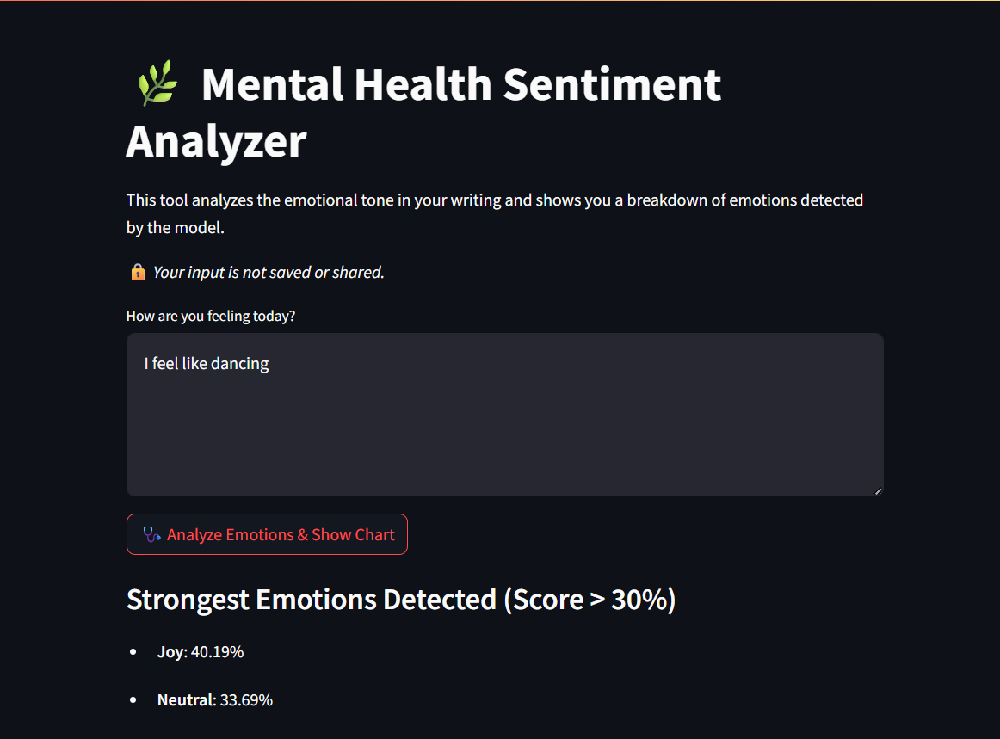

# Mental Health Sentiment Analysis Project

A deep learning-powered mental health sentiment analysis tool that uses a fine-tuned RoBERTa model to classify emotional states such as **Depression**, **Anxiety**, **Suicidal thoughts**, **Stress**, **Bi-Polar**, **Personality Disorder**, and **Normal**. Built with NLP best practices and deployed through an interactive Streamlit web app.



[Fine Tuned RoBERTa model deployed on HuggingFace](https://huggingface.co/lishaangral/roberta-mental-health)

### 🌐 Use on Deployed App (Streamlit Cloud)

> Visit the hosted URL [Streamlit Link](https://mental-health-sentiment-analysis.streamlit.app/)

---

## Overview

Mental health issues often go unnoticed in plain text. This project uses state-of-the-art NLP to detect nuanced psychological cues in user input by analyzing text and returning a detailed emotional breakdown. The tool is designed to assist early detection and reflection.

---

### Key Features

- **91%+ Accuracy** on real-world clinical and social media mental health datasets
- **Fine-tuned RoBERTa** model for emotion classification
- Trained on **45,000+ labeled entries** from both clinical and anonymized social media sources
- **Streamlit Dashboard** to visualize emotion predictions
- Psychological **text preprocessing** using NLTK (removal of negation bias, stemming, and affective filters)
- *No input is stored or shared* – privacy-focused interaction

## Emotion Classes

| Label                | Description                                                                 |
|---------------------|-----------------------------------------------------------------------------|
| Normal              | Text shows no signs of mental distress                                      |
| Depression          | Signs of low mood, helplessness, or lack of energy                          |
| Suicidal            | Mentions or implications of self-harm, hopelessness                         |
| Anxiety             | Expressions of excessive worry, nervousness                                 |
| Stress              | Mental or emotional strain due to external/internal pressures               |
| Bi-Polar            | Indications of extreme mood swings or instability                           |
| Personality Disorder| Identity disturbances, unstable interpersonal relationships, erratic moods |

---

### 🛠️ Tech Stack

| Technology                        | Purpose                                                       |
| --------------------------------- | ------------------------------------------------------------- |
| **Python**                        | Core programming language                                     |
| **HuggingFace Transformers**      | Fine-tuned RoBERTa model for text classification              |
| **PyTorch**                       | Deep learning backend for the transformer model               |
| **Streamlit**                     | Interactive UI to collect and display sentiment predictions   |
| **NLTK**                          | Natural Language Toolkit for preprocessing psychological text |
| **Pandas**                        | Data handling and transformation                              |

---

### 🔄 How to Use

1. **Clone the repository**

```bash
git clone https://github.com/lishaangral/mental-health-sentiment-analysis
cd mental-health-sentiment-analysis
```

2. **Install dependencies**

```bash
pip install -r requirements.txt
```

3. **Run the Streamlit app**

```bash
streamlit run app/streamlit_app.py
```

4. **Interact via browser**

The app will open in your default browser.
Type your current thoughts or mood, and the model will show emotion labels like *Depression, Anxiety,* etc., along with confidence levels.

---

### Future Scope

* **Chatbot Integration**: Add a psychological wellness chatbot trained on therapeutic dialogue for more human-like engagement.
* **Fine-tune on Psychology Textbooks**: Expand the dataset by incorporating structured clinical content from DSM-5, psychology manuals, and academic books.
* **Emotion Trend Tracker**: Track user emotion patterns over time using local storage or optional login-based persistence.
* **Custom Alerts**: Notify users of critical emotional thresholds and suggest emergency contacts/resources.
* **Multi-class Emotion Detection**: Extend classification to include emotions like *Guilt, Shame, Joy, Loneliness, Anger* using emotion wheel principles.
* **Speech & OCR Input**: Accept voice and screenshot inputs to expand beyond typed interaction.
* **Multilingual Support**: Include support for Hindi, Spanish, and other major languages.

---

## Datasets & Resources Used

Fine-tuned on:

* [The Diagnostic and Statistical Manual of Mental Disorders (DSM-5)](https://psychiatryonline.org/doi/book/10.1176/appi.books.9780890425787)
* [Kaggle: Sentiment Analysis for Mental Health](https://www.kaggle.com/datasets/suchintikasarkar/sentiment-analysis-for-mental-health)

These sources provided diverse and labeled emotional data (stress, suicidal ideation, support-seeking, etc.) for supervised training.

---

## 🧾 License

MIT License © 2025 \[Lisha Angral]


### ⚠️ Ethical Disclaimer

This application is developed for **educational, reflective, and non-clinical purposes only**.

* It is **not a replacement** for professional diagnosis, therapy, or treatment.
* Always consult a licensed mental health professional for serious or recurring symptoms.
* This tool **does not store or share** your input. All data processing happens locally or via HuggingFace APIs, with strict adherence to user privacy.
* Predictions are based on AI models trained on real-world but non-clinical data and may **not generalize to all populations or conditions**.

> 💡 If you're in crisis or feeling unsafe, please contact a **mental health helpline** or **emergency services** immediately.

---

Let me know if you'd like this entire README exported to a `.md` file or want a PDF version for submission/documentation. I can also generate a logo, add example screenshots, or help you deploy it live on HuggingFace or Streamlit Cloud.
